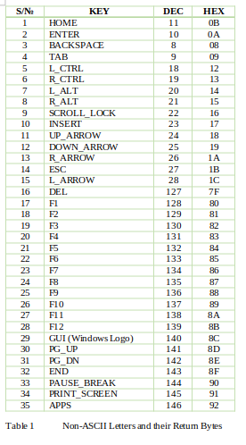

# PS2 KEYBOARD HOST FIRMWARE USER GUIDE

> This document is a user guide for a bi-directional PS2 keyboard communication firmware. The firmware is provided to interface a generic PS2 keyboard with an AVR microcontroller. Any key-press is returned to the host system via USART0 of the MCU.

- Software Platform: 	Embedded C 
- Hardware Platform:	ATMEL® AVR MCU
- Firmware Revision:	April, 2018

##  NOTE:	ENSURE TO READ THIS CAREFULLY BEFORE USING THE FIRMWARE

### USAGE

- A PS2 keyboard should be connected to an AVR microcontroller through its INT0 and INT1. Any key-press is returned to the host system via USART0 of the MCU, which is configured to run in Asynchronous mode. So, the host MCU should also run its USRAT in asynchronous mode, in order to communicate with the keyboard controller.

- The reset pins of both the PS2 Keyboard controller and that of the central MCU should be connected together for simultaneous reset. Note that reset pin of AVR MCU is ACTIVE LOW. The controller resets the keyboard on MCU reset or on power-up, even if the keyboard uses a separate power supply.

- For a fully interactive test, prototype the keyboard circuit (refer to PS2 keyboard user manual for current requirements) and connect to the PC via USART0 with the following COM port configuration:

- Baud rate:	57600
- Stop bits:	one (1)
- Parity:		None
- Data bits:	Eight (8)

### NOTE
- A logic converter module is required such as TTL-to-USB converter.

-   MikroElektronika Usart Terminal provides for selecting Data format and New Line settings, which will help you in printing return values of both printable and non-printable keys. In this case, you can select HEX or DEC, instead of ASCII.
0x0A (‘\n’) is returned for Line Feed when Enter key is pressed, and 0x09 (‘\t’) for Tab key.
- The following table lists the supported non-printable keys and their return bytes.

### IMPORTANT NOTES

- The PS2 host reads a key-press from the Standard English PS2 keyboard, and returns its corresponding ASCII through USART0 of AVR MCU. For function keys and other non-printable keys, it returns the corresponding values as listed in Table 1 above.

- The firmware was compiled with 20 MHz crystal as system clock source, and USART baud rate of 57600. But the source code can be modified, otherwise, with desired options. However, the crystal frequency should NOT exceed 20 MHz. Also, for minimal error, the baud rate should NOT exceed 57600 at 20 MHz.

- he clock pin of the PS2 keyboard should be connected to INT0, and data pin connected to INT1. It is recommended to connect a 10 kΩ resistor to each of clock and data pins (INT0 and INT1). Also, connect a 100 Ω resistor in series with each of the data and clock pins, to avoid undesirable loading.

- The host system can detect keyboard anytime by sending ECHO_RESPONSE command byte, 0xEE to the PS2 host via USART. Upon receipt of 0xEE, the PS2 host checks for keyboard presence, returns 0xEE in response, if a PS2 keyboard is connected, and 0xFF otherwise. Note that in this application, only the command 0xEE is supported for the PS2 host MCU to respond to, when received from the host system. All other commands such as LED control, ACK, RESET, etc., are handled by the Host MCU.

- LED Control keys respond only once on every press. This means that typematic repeats (i.e. when a key is held down for longer duration) are ignored.

- GUI (Windows Logo) key is returned on key release, i.e., it is ignored on key-press, and returned on key-up.

- Ctrl, ALT, and APPS keys are returned once on every press. This means that typematic repeats (i.e. when a key is held down) are ignored.

## Author

👤 **Sunday Uche Ezeilo**

- Github: [@sundayezeilo](https://github.com/ezeilo-su)
- Twitter: [@SundayEzeilo](https://twitter.com/SundayEzeilo)
- Linkedin: [Sunday Ezeilo](https://www.linkedin.com/in/sunday-ezeilo-a6a67664/)

## 🤝 Contributing

Contributions, issues and feature requests will be appreciated.

Feel free to check the [issues page](https://github.com/ezeilo-su/ps2KbHost/issues)

## Show your support

Show support by giving a ⭐️ if you like this project!

## 📝 License

This project is MIT licensed.